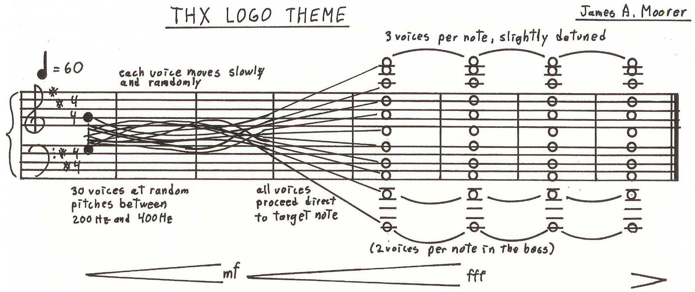

# thx-deepnote

A Python simulation of the THX intro theme (AKA "THX Deep Note"). [Here's](https://www.thx.com/deepnote) what it's actually supposed to sound like.

The simulation is based on the above score [(image source)](https://www.facebook.com/thxltd/posts/10155235578381930). Thirty notes wander randomly between 200-400 Hz, then move to their target frequencies in D major.

## Installation

This should just require `numpy` and `scipy`, and can be run using `python3 deepnote.py`. It took about 10 seconds to produce output on my machine.
